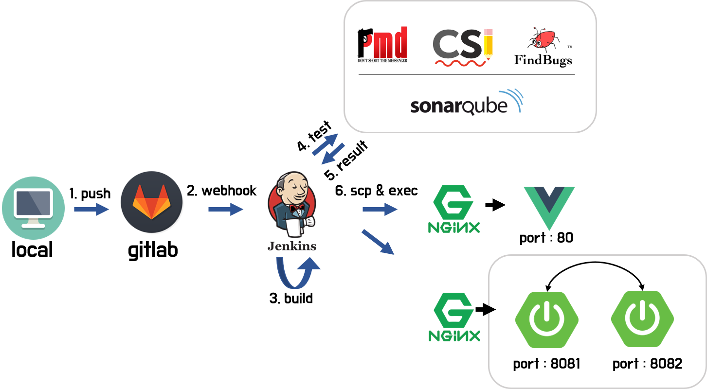

# <span style="color:#fd462e"> Just DDA It! </span>
> SNS 기반 Study 모바일 웹 어플리케이션

---
## Overview
> + 유저 세션
>     - 이메일 인증
>     - 이메일을 통한 비밀번호 찾기
>     - 팔로우 기능
> + 자격증 세션
>     - 유저에게 자격증 정보를 제공
>     - 유저에게 자격증 관련 리뷰를 제공
>     - 유저가 찾는 자격증 외 다른 자격증을 추천
> + 스터디룸 세션
>     - 함께 스터디를 진행할 수 있는 스터디룸을 제공
>     - 단체 일정을 추가하고 공유 기능
>     - 피드를 통한 공부 인증
>     - 스터디룸 비공개 기능
> + 피드 세션
>     - 댓글 기능
>     - 좋아요 기능
>     - 24시간 동안 가장 좋아요 많이 받은 유저 순위 제공

---
## Execution
> ##### <span style="color:red">Local에서 실행 시, develop 브랜치의 코드로 진행하세요. </span>
> ---
> 
> ##### Docker가 없을 경우
> ##### [도커 설치](https://www.docker.com/get-started)  
>  --- 
>
> ### DB
>  
>  **cmd**창이나 **terminal**창을 켠뒤, 다음 명령어 입력.  
> 만약, 실행환경이 **linux** 환경이라면 아래 명령어를 입력하기 전에 `sudo su` 명령어를 입력한다.
> ```command
> > docker run --name {컨테이너 이름} -p 3306:3306 -e MYSQL_ROOT_PASSWORD={비밀번호} -d mariadb    # mariadb서버 생성
> > docker exec -it maria-db mysql -u root --password={비밀번호}                                 # db서버 접속
> ```
> 그러면 DB에 접속이 된다.  
> 이제 다음 명령어를 입력해 skeleton이라는 데이터베이스를 생성한다.
> ```db
> MariaDB [(none)] > CREATE DATABASE SKELETON    # database 생성
> MariaDB [(none)] > QUIT    # DB 빠져나오기
> ```
> JPA를 통해 테이블을 생성할 것이기 때문에 DB는 추후 자격증 정보를 넣을 때 까지 신경쓸 필요가 없다.
> ### Backend
> src/main/resources/application.properties에 들어간다.  
> 아래 내용만 수정한다. (안에 있는 정보 악용 금지!)  
> ```
> (생략)
> spring.datasource.url=jdbc:mysql://{DB 서버 주소}:3306/skeleton?(~이하 생략~)
> spring.datasource.username=root
> spring.datasource.password={DB 비밀번호}
> (생략)
> ```
> 
> 그리고 IDE에서 src/main/java/com/ssafy/study/**StudyApplication**을 Run 시킨다. ~~끝이다~~  
>  
> STS나 IntelliJ와 같은 IDE를 사용할 것을 추천하나, 피치 못할 사정으로 CLI방식으로 해야한다면...😭  
> application.properties를 똑같은 형식으로 수정한 뒤, backend 디렉토리에서 command 창을 연다.
> ```
> > mvn clean install   # !! mvn이 없으면 설치해야 함.
> ```
> 위 명령어를 통해 빌드를 한 뒤, 직접 웹 서버를 사용해 jar파일을 실행해야 한다.
> docker를 사용하는 사람을 위해 Dockerfile을 만들어 놨으니(~~사실 내가 쓰다가 지우기 귀찮아서 놔둠...~~) docker를 사용한다면 다음과 같은 방법을 사용해도 된다.
> ```command
> > docker build -t {이미지 이름} -f Dockerfile ./
> > docker run --name {컨테이너 이름} -p 8080:8080 -d {이미지 이름}
> ```
> 이렇게 하면 8080포트로 백엔드 서버를 실행 시킬 수 있다.
> ##### 참고 - [도커 빌드 관련](https://docs.docker.com/engine/reference/commandline/build/)
> ### Frontend
> console창에 npm 명령어를 통해 서버를 실행한다.
> ```command
> > npm install
> > npm run serve
> ```
> ### More
> 자격증 정보를 DB에 넣는 작업을 해야하는데... 이건 추후 업뎃하겠음.

---
## Stack & Environment
> ```
> OS : Windows 10(develop), Ubuntu 18.04.1 LTS (deploy)
> IDE : Visual Stuid Code, Spring Tool Suite 3, IntelliJ
> DB : MariaDB
> Language : Java 1.8 , JavaScript
> Browser : Chrome / 아래 참고
> Framework : Spring, Vue, JPA
> Etc : Docker, Nginx, Jenkins, Sonarqube(pmd,checkStyle,findBugs)
> ```
> ##### [지원 브라우저](https://kangax.github.io/compat-table/es6) 


---
## Web Infrastructure
> 
>
> ## 간단 설명
> aws ec2 서버 위에 docker를 설치 한 후, docker container 위에 3개의 nginx와 jenkins, sonarqube, MariaDB 총 6개의 컨테이너가 올라가있다.  
> 각각의 컨테이너에 대해 가볍게 알아보자.
> ### Jenkins
> Jenkins는 CI툴로 git 저장소(gitlab)에서 push나 merge와 같은 이벤트가 일어났을 때 webhook을 통해 jenkins에 전달이 되고 자동 통합 및 빌드가 일어난다.  
> 보다 자세한 내용은 [CI/CD](#cicd)쪽에서 다루겠다.  
> ##### [Jenkins sever](http://i3a102.p.ssafy.io:8090) 
> id : `visitor`  , password : `s03p13a102`
> ### SonarQube
> SonarQube에 있는 pmd, checkStyle, findBugs는 정적 분석 툴로 플러그인 형태로 SonarQube 사이트에 올라가있다.  
> Jenkins에서 빌드 성공 시 코드를 정적 분석해주고 결과물을 제공한다.  
> ##### [SonarQube sever](http://i3a102.p.ssafy.io:8070/dashboard?id=ssafyProject) 
> ### nginx
> 3개의 nginx 위에는 프론트엔드 서버, 프록시 서버, 백엔드 서버가 올라가있다.
> 백엔드 서버는 하나의 nginx 컨테이너에 두 개의 Springboot jar가 다른 포트를 가지고 있어 서비스를 중지하지 않고 배포할 수 있다. 따라서, 프론트 서버에서 백엔드 서버로 요청을 보낼 때 어떤 백엔드 서버의 port가 연결되어 있는지 알 수 없다.  
> 이 문제를 해결하기 위해 proxy server를 두어 프론트 서버에서 8080포트로 요청을 보내면 proxy 서버가 8080포트로 오는 요청을 8081이 연결 되어 있으면 8081로, 8082가 연결 되어 있으면 8082로 요청을 보낸다.
>

---
## CI/CD Flow 
> 
> ## Overview
> CI는 jenkins를 사용하였고 SonarQube와 연동을 하여 코드 정적 분석 기능을 추가하였다.
> CD는 nginx를 통해 무중단 배포 서비스를 구현하였다.
> ### Flow Description <a name="cicd"></a>
> 로컬에서 코드를 작성 후 master 브랜치에 push를 하게되면 jenkins에 webhook이 날아가고 jenkins 서버에서 git으로부터 repository을 가지고 온다.  
> git에서 정상적으로 가지고오면 jenkins에서 SonarQube 서버에 코드를 보내 검사를 요청한다.  
> SonarQube에서 설치된 plugin에 따라 코드의 버그나 취약점 등 코드 분석을 실시한다.  
> ```
> ## SonarQube Plug-in  
> PMD : 응용 프로그램에서 발견된 문제를 보고하는 오픈 소스 정적 Java 소스 코드 분석기. 문법적으로 오류 가능성이 높은 항목들을 체크해서 알려줌.  
> CheckStyle : 코딩 스타일 규칙을 정의하여 체크해줌.  
> FindBugs : 정적 분석 제공 툴. 기본적으로 발생할 수 있는 결함을 확인하고 Report해줌.  
> ```
> SonarQube에 통과 기준을 설정해 분석 결과가 기준을 넘기면 **Pass**와 함께 결과를 jenkins에 보내준다.  
> Jenkins는 성공 결과를 받으면 코드를 다음 script를 통해 빌드 한다.  
> ```
> Backend는 `mvn clean install`
> Frontend는 `npm install` 후, `npm run build`
> ```
> 빌드가 완료되면  빌드를 통해 나온 실행 파일 및 디렉토리들을 scp를 통해 aws ec2서버로 보낸다.  
> 동시에 aws ec2서버에 ssh로 접속해 shell script 파일을 실행시켜 각각 서버를 실행시킨다.
> ```
> Frontend는 docker container를 restart하는 방법을 통해 배포한다.
> Backend는 여러 yml 파일들을 통해 8081포트와 8082포트 중 사용되지 않은 포트를 선택하여 구동시키고 다른 포트로 배포되어있는 서버를 종료시킨다.
> ```


---
